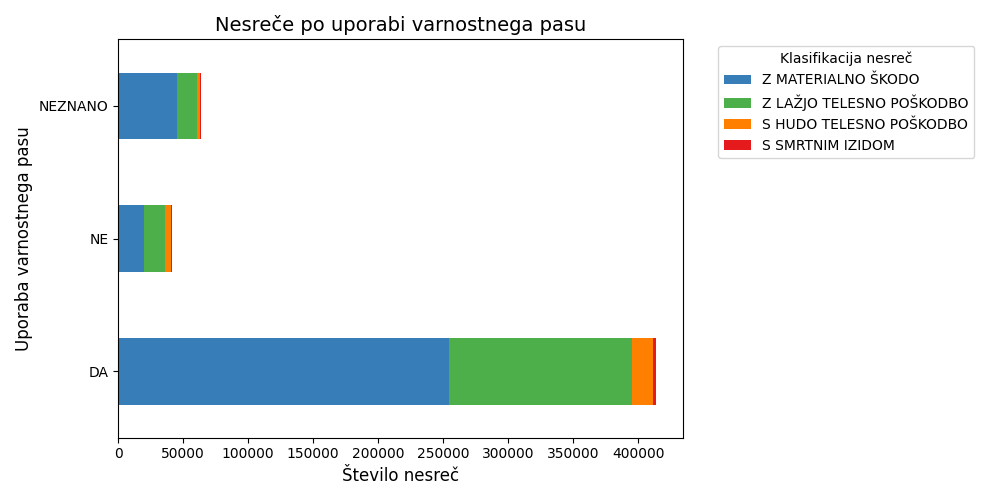
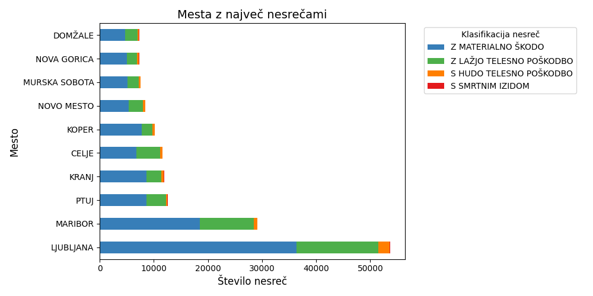
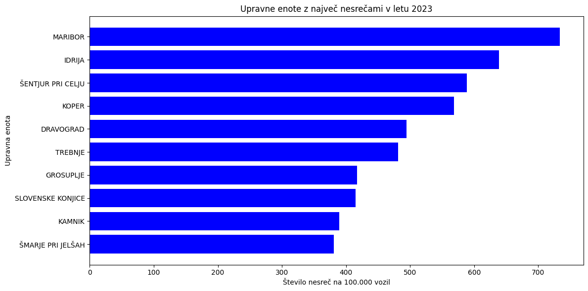
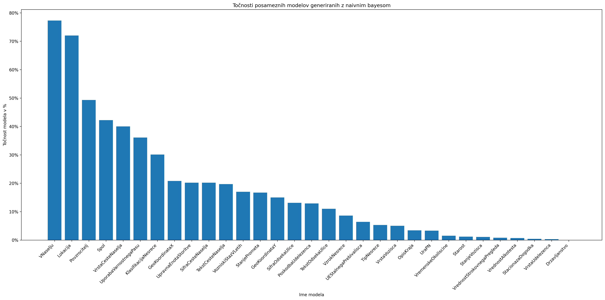
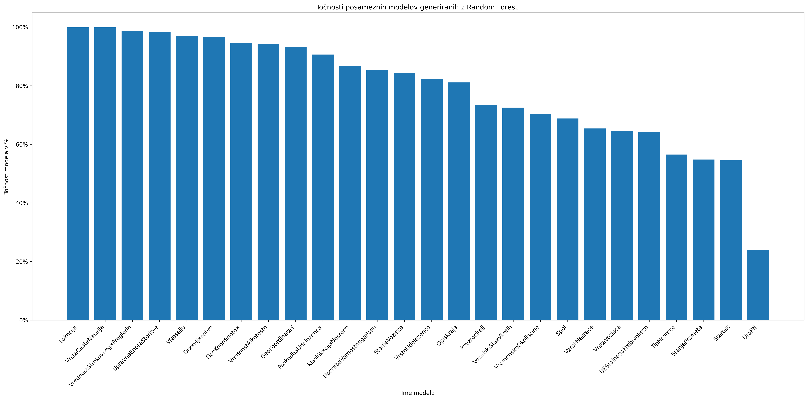
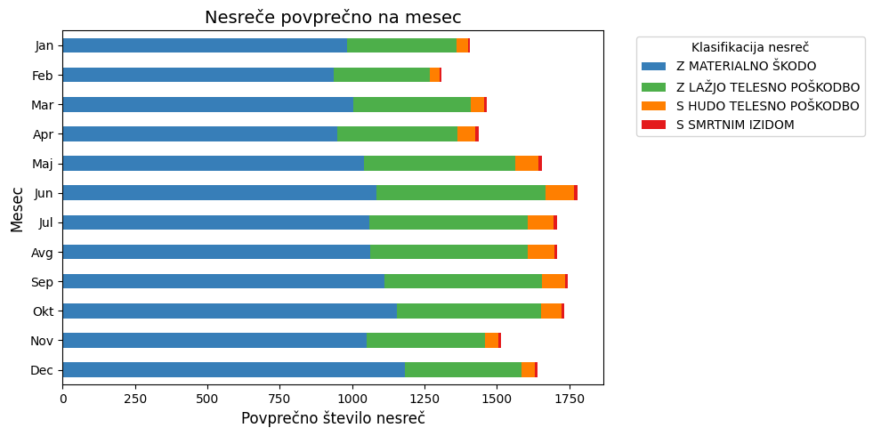
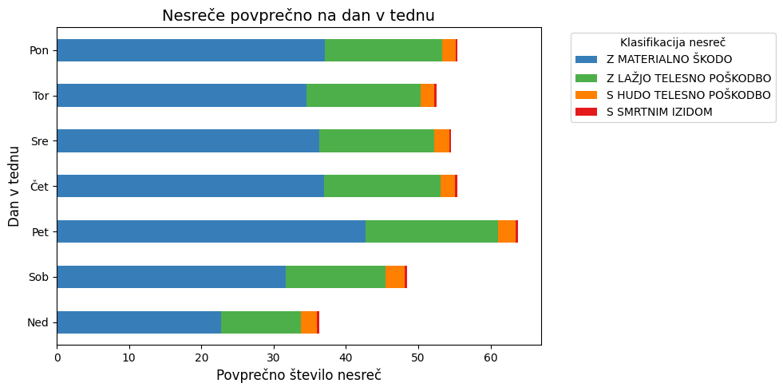
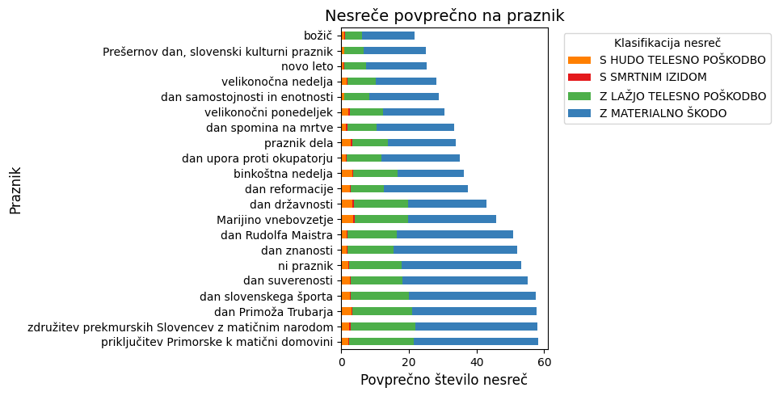
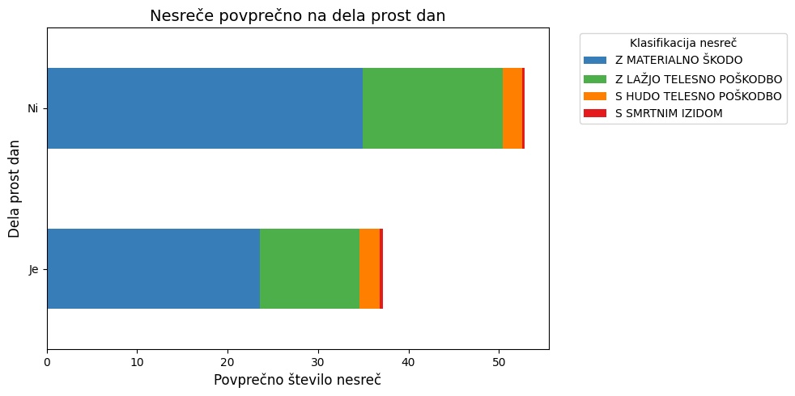
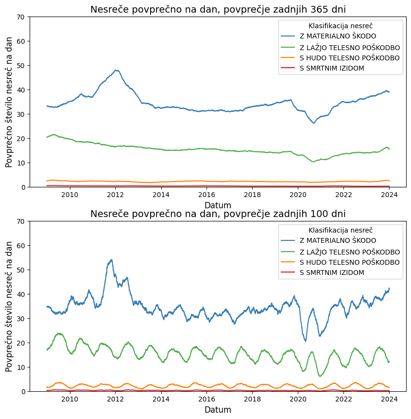

# Končno poročilo o opravljenem delu

## 📖 Tema seminarske naloge
- Analiza prometnih nesreč v Sloveniji, razvoj napovedovalnih modelov

## 📊 [Podatki](https://podatki.gov.si/dataset/mnzpprometne-nesrece-od-leta-2009-dalje)

### Podatki o nesrečah:
- Identifikacijska številka nesreče
- Klasifikacija nesreče glede na posledice
- Upravna enota kraja nesreče
- Datum in ura nesreče
- Lokacija nesreče (naselje, vrsta ceste, odsek, hišna številka itd.)
- Opis prizorišča nesreče
- Glavni vzrok nesreče
- Tip nesreče
- Vremenske okoliščine in stanje prometa v času nesreče
- Stanje vozišča in površine vozišča
- Geo koordinate nesreče

### Podatki o udeležencih:
- Identifikacijska številka osebe v nesreči
- Vloga osebe v nesreči (povzročitelj, oškodovanec)
- Starost in spol osebe
- Upravna enota stalnega prebivališča
- Državljanstvo osebe
- Vrsta udeleženca v prometu
- Poškodba osebe
- Uporaba varnostnega pasu ali čelade
- Vozniški staž osebe (leta, meseci)
- Rezultati alkotesta in strokovnega pregleda, če so bili opravljeni (mg/l izdihanega zraka, g/kg krvi)

## Osnovna analiza

### Cilji

Cilji osnovne analize so bili ugotoviti, kako različni dejavniki vplivajo na nesreče, katera mesta so "najnevarnejša" ter grafično prikazati nesreče na zemljevidu. Vsa koda poteka analize je v `analiza.ipynb`

### Klasifikacija nesreče

`KlasifikacijaNesrece` ima lahko štiri vrednosti: `Z MATERIALNO ŠKODO`, `Z LAŽJO TELESNO POŠKODBO`, `S HUDO TELESNO POŠKODBO` in `S SMRTNIM IZIDOM`. Radi bi ugotovili, kako ostali atributi vplivajo na izid nesreče. Če jih razvrstimo le po enem atributu – recimo, ali je bil uporabljen varnostni pas ali ne – dobimo naslednji graf:  

Ta graf ni posebej informativen, saj je veliko več udeležencev uporabljalo pas, zato na prvi pogled izgleda, kot da uporaba pasu ne vpliva na izid nesreče. Če pa pogledamo razmerja, se lepo vidi, da je več smrtnih izidov v primerih, ko pas ni bil uporabljen.  

Prav tako smo izvedli analizo za ostale atribute – njihovi grafi so na voljo v [Streamlit](https://pr2520-promet.streamlit.app) aplikaciji.

### Povzročitelj

Pri analizi povzročiteljev prometnih nesreč smo ugotovili, da je večina povzročiteljev moškega spola (od vseh udeleženih je 35 % moških povzročiteljev, medtem ko je pri ženskah ta delež 25 %). Poleg tega je 77 % vseh udeležencev, katerih spol je neznan, označenih kot povzročitelji, kar verjetno pomeni, da so pobegnili s kraja nesreče.

Največ nesreč povzročijo osebe v starosti med 20 in 30 let. Ta starostna skupina je očitno bolj nagnjena k tveganemu vedenju v prometu, kar lahko pripišemo pomanjkanju izkušenj. Zanimivo je tudi, da se med povzročitelji pojavlja precejšnje število mladoletnih oseb, ki so večinoma udeležene v nesrečah kot kolesarji.

### "Najnevarnejša" mesta

Najprej smo preverili, v katerih mestih se zgodi največ nesreč, in dobili naslednji graf:  

Logično je, da se v večjih mestih zgodi največ nesreč, saj so tudi najbolj prometno obremenjena. Zato ta graf še ne odgovori na vprašanje, katero mesto je najnevarnejše.

Na spletni strani Odprti podatki Slovenije smo pridobili podatke o [prometnih obremenitvah](https://podatki.gov.si/dataset/pldp-karte-prometnih-obremenitev). Podatki o prometnih nesrečah in obremenitvah se niso najbolje ujemali, zato jih je bilo težko neposredno povezati.

Uporabili smo Python knjižnico `thefuzz`, ki primerja nize in oceni njihovo podobnost. Koda se nahaja v datoteki `/promet_po_upravnih_enotah.py`, ustvarjeni `.csv` pa v `podatki/vsota_vozil_po_upravnih_enotah.csv`. Ko izrišemo graf, dobimo:  

Iz grafa smo odstranili osamelce, ki so nastali zaradi približnega ujemanja nizov. Kljub temu pa graf ni povsem zanesljiv zaradi narave približne primerjave.

### Grafični prikaz

Ker podatki vključujejo tudi geografske koordinate krajev, kjer so se nesreče zgodile, smo te podatke uporabili za vizualizacijo nesreč na zemljevidu. Prikazali smo jih v obliki raztresenega diagrama, ki omogoča vpogled v prostorsko porazdelitev nesreč, in toplotne karte, ki poudarja območja z večjo gostoto nesreč. Ti prikazi so uporabni za identifikacijo kritičnih točk.

## Napovedovalni modeli

### Modeli za napovedovanje vrednosti generirani z naivnim bayesom.

#### kratka predstavitev podatkov v modelu

Od vseh originalnih podatkov so izbrisani stolpci (zaradi nepomemnosti pri napovedovanju):
- datum prometne nesreče (se skoraj vsakič spreminja)
- zaporedna številka osebe v prometni nesreči (vsaka oseba unikatno številko) 
- vozniški staz v mesecih (podatek nepomemben, ker obstaja podatek vozniški staz v letih)
- zaporedna številka nesreče (unikatne številke nesreče)

Od preostalih podatkov so bili še izbrisani tisti, ki niso imeli vrednosti:
- NaN vrednosti
- 0 vrednosti v koordinatah
- -1 vrednost pri starosti

Večina vrstic je že prisotnih v diskretni obliki. Zvezne spremenljivke pa so bile diskritizirane na intervale:
- ura nesreče iz ura:minuta -> ura (23.15 -> 23)
- koordinate na intervale velike 10000 (230000 -> 23 pomen: koordinata od 230000-239999)
- starost na intervale velike 10 (25 -> 2 pomen: starost od 20-29 let)
- vozniški staz v letih na intervale velike 10 (25 -> 2 pomen: vozniški staz od 20-29 let)
- vrednost alkotesta in vrednost strokovnega pregleda na intervale velike 0.1 in pretvorba v cela števila(1.12 - 11 pomen vrednost 1.1 - 1.19)

Po pretvorbi vseh spremenljivk v diskretne, tiste ki so predstavljeni kot nizi mapiarmo v celoštevilske vrednosti v obliki json datotek.

Modeli nimajo privzete možnosti za shranjevanje, zato se za zhranjevanje natreniranih modelov (obljektov) uporabljajo pkl datoteke.

#### uspešnost modelov

Modeli zo bili generirani z modelom naivni bayes.
Med generiranimi modeli se vredu odnesejo tisti, ki imajo na izbiro samo 2 ali 3 možne napovedi.
V našem primeru VNaselju, spol, povzročitelj in lokacija. Veliko modelov pa napoveduje zelo slabo, kar
pa je lahko problem izbire modela ali pa pomeni, da podatki za tisti stolpec nimajo neko povezave z ostalimi atributi.

Stolpični diagram prikaza natančnosti modelov.

### Modeli za napovedovanje vrednosti generirani z random forest.

Podatki so preprocesirani enako kot v zgorjnem opisu. Pri modelu se uporablja 200 dreves, ki pa precej bolje napovedujejo kot modeli zgenerirani
z naivinim bajesom. Problem random forest modelov je, da potrebujejo za učenje veliko več pomnilnika in ker tudi ta model ne podpira shranjevanja modelov se uporabljajo pkl datoteke.
Modeli zgenerirni z metodo random forest niso objavljeni na repozitoriju zaradi njihove velikosti (30GB), zato če jih želite preizkusiti jih je treba zgenerirati lokalno.
Pri metodi je 5 modelov izpuščenih, saj so preveč računsko zahtevni in zavzamejo preveč prostorja ter pomnilnika (32GB RAM-a in dodatnih 120GB swap pomnilnika za generiranje modela).
Razlog za tako zahtevne modele pa je da imajo čez 5000 različnih možnosti za atribute. Poleg modelov pa je prikazan še graf za vsak model, ki vzame eno izmed 200 dreves in ga prikaže
do globine 2, da lahko približno vidimo kateri atributi so najpomembnejši pri napovedovanju. Prikaz pa ni najboljši saj se za generiranje modelov uporablja mapping namesto onehot encodinga 
in je prikaz na grafih precej nesmiselen (vrednost atributa <= 4.5 pri diskretnih vrednostih). 

Stolpični diagram prikaza natančnosti modelov.

### Napovedovanje

Pri obeh modelih lahko napovedujemo ciljne spremenljivke brez vseh podatkov. Če kateri od podatkov manjka ga nadomestimo z vrednostjo "-1" in se ob napovedi zamenja z največkrat ponovljeno vrednostjo v tistem stolpcu (tudi pri naivnem bayesu,
čeprav to model sam podpira). Podatke ki uporabnik vnese se spet pretvorijo preko mappingov v celoštevilske vrednosti, preden se izvede napoved. Ob poklicani napovedi se naloži željen model in vrne napovedano vrednost.
Na spletni aplikaciji se uporabljajo slabši modeli z naivnim bajesom, ker so modeli generirani z random forest-om preveliki. 

#### ideja ustvarjanja modelov

Modele za napovedovanje katerih koli stolpcev želimo realizirati, ker bi lahko bili uporabni pri svetovalnih sistemih
za klice v sili. Ob klicu pridobijo določene podatke po navadi pa ne vseh. Modele bi lakho uporabili za napovedovanje 
teh manjkajočih podatkov. Glede na napovedi bi se lahko v naprej pripravili za najbolj verjetno stanje, ki jih čaka.

## Časovna analiza

### Povzetek

Predmet analize so časovni vzorci v prometnih nesrečah. Fokus je na ugotavljanju, kako so porazdeljene prometne nesreče glede na mesec, dan v tednu, ali je dan praznik in iskanje trendov s tekočim povprečjem.

### Podatki

Stolpec `DatumPN` je pretvorjen v `Pandas` `DateTime` objekt za lažjo manipulacijo z datumi. Dodani so tudi stolpci za dan, mesec, leto, in dan v tednu.

### Najnevarnejši meseci

Nesreče so grupirane po mesecu v letu in deljene s številom let v podatkih.

**Ugotovitev:** Največ nesreč se zgodi v poletni polovici leta, med mesecem majem in oktobrom - približno `1700` na mesec. 

### Najnevarnejši dnevi v tednu

Nesreče so grupirane po dnevu v tednu in deljene s številom tednov v podatkih.

**Ugotovitev:** Na vikend se zgodi najmanj nesreč, v petek pa največ. Na najnevarnejši dan, petek, se zgodi skoraj dvakrat toliko nesreč kot na najmanj nevaren dan, nedeljo - približno `30` nesreč razlike.

### Vpliv praznikov

Ustvarjen je slovar datumov in praznikov v Sloveniji, dobljenih iz `https://www.gov.si/teme/drzavni-prazniki-in-dela-prosti-dnevi/`. Nesreče so nato grupirane po praznikih in deljene s številom praznika v podatkih.

**Ugotovitev:** Na večino praznikov se zgodi manj nesreč kot na tipičen dan, ko ni praznika. Najmanj nesreč se zgodi na božič, največ pa na priključitev Primorske k matični domovini.

### Dela prosti dnevi

Dodan je stolpec, ki opisuje, ali se je nesreča zgodila na dela prost dan. Nesreče so nato grupirane po tem, ali so se zgodile na dela prost dan, in deljene s številom teh dni.

**Ugotovitev:** Dejstvo, ali je dan dela prost, ima velik vpliv na število nesreč. Na dela prost dan se zgodi manj nesreč, približno `20` nesreč manj, kot na normalen dan.

### Trendi

Nesreče so grupirane po datumu in prikazane na grafu s tekočim povprečjem zadnjih `100` in `365` dni.

**Ugotovitev:** Povprečje zadnjih `100` dni pokaže tudi sezonsko nihanje, ker se več nesreč dogaja med poletjem kot zimo. `365`-dnevno povprečje medtem pokaže splošni trend naraščanja števila nesreč, z upadom med leti `2020` in `2022`, v času COVID-19.

## [Streamlit](https://pr2520-promet.streamlit.app)

Večino ugotovitev in grafov ter uporaba modela naivnega bayesa (saj ni tako kompleksen) je na voljo v [Streamlit](https://pr2520-promet.streamlit.app) aplikaciji. Vsa koda povezana z njo je zaradi preglednosti v branchu [streamlit](https://github.com/BlazJe/PR2520/tree/streamlit). Da bi se izognili veliki obremenitvi se tukaj uporablja le podatke od 2020-2023.
