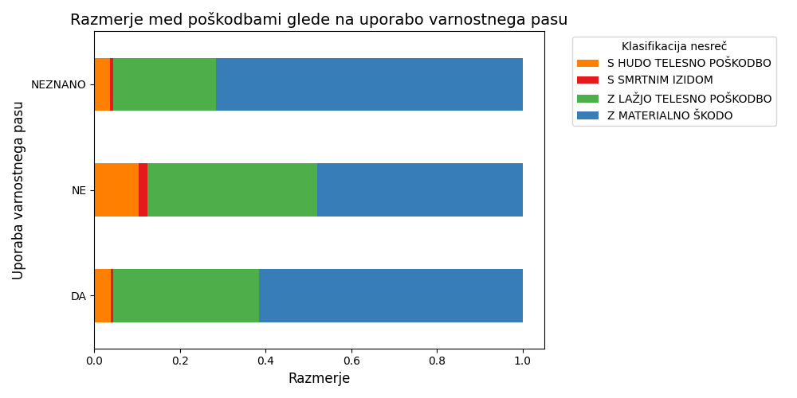
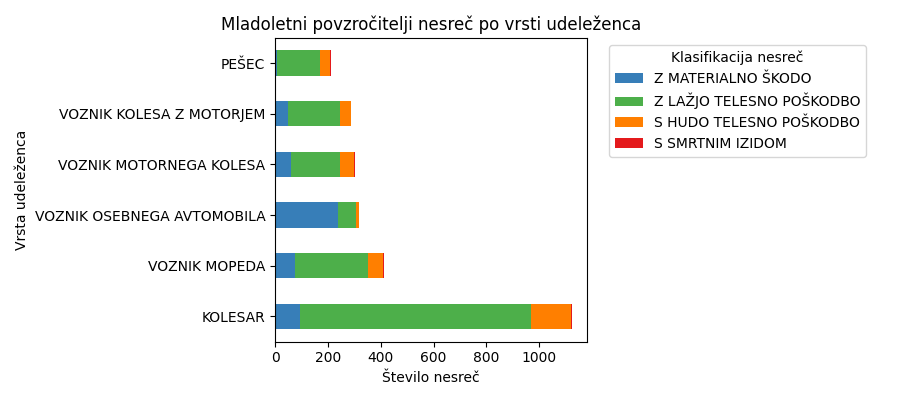
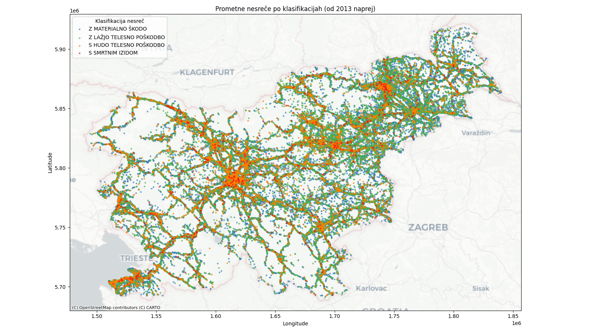
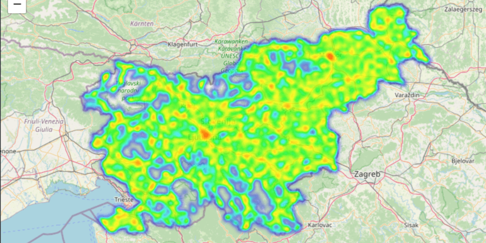
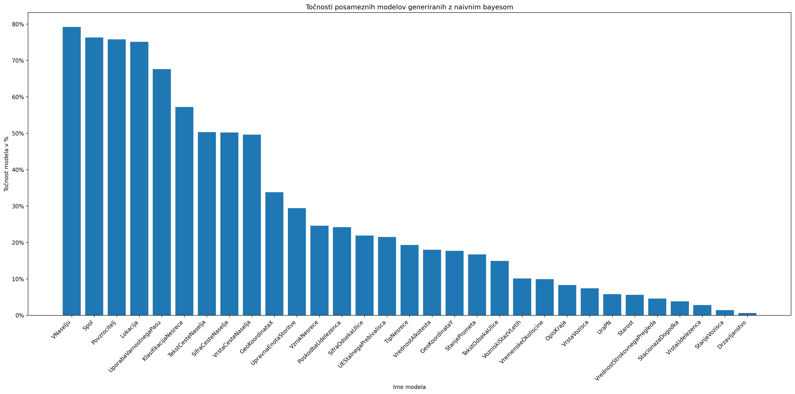

# Vmesno poročilo o opravljenem delu

Za seminarsko nalogo smo se odločili podrobno analizirati prometne nesreče, ki so se zgodile na območju Slovenije, in na podlagi pridobljenih podatkov razviti napovedni model, ki bi omogočal boljše razumevanje dejavnikov, ki vplivajo na nastanek nesreč.

## Analiza

Prva stvar, ki nas je zanimala, je bila analiza vpliva uporabe varnostnega pasu na resnost prometnih nesreč. Kot pričakovano smo ugotovili smo, da je pri udeležencih, ki niso uporabljali varnostnega pasu, odstotek nesreč s hujšimi poškodbami ali smrtnim izidom bistveno višji v primerjavi z udeleženci, ki so pas uporabljali. Ta ugotovitev potrjuje pomembnost uporabe varnostnega pasu kot enega ključnih dejavnikov za zmanjšanje resnosti poškodb v primeru nesreče. Razmerja med posameznimi skupinami udeležencev so prikazana na spodnjem grafu:

Pri analizi povzročiteljev prometnih nesreč smo ugotovili, da je večina povzročiteljev moškega spola (od vseh udeleženih je 35% povzročiteljev med tem ko pri ženskaj je ta vrednost 25%). Poleg tega je 77% vseh vdeležencev katerih spol je neznan povzročiteljev kar vrjetno pomeni da so pobegnili s kraja nesreče. Največ nesreč povzročijo ljudje 20 in 30 let. Ta starostna skupina je očitno bolj nagnjena k tveganemu vedenju v prometu, kar lahko pripišemo pomanjkanju izkušenj. Zanimivo je tudi, da se med povzročitelji pojavlja precejšnje število mladoletnih oseb, ki so večinoma udeležene v nesrečah kot kolesarji. Spodnji graf prikazuje podatke o mladoletnih povzročiteljih:

Ker podatki vključujejo tudi geografske koordinate krajev, kjer so se nesreče zgodile, smo te podatke uporabili za vizualizacijo nesreč na zemljevidu. Prikazali smo jih v obliki raztresenega diagrama, ki omogoča vpogled v prostorsko porazdelitev nesreč, in toplotne karte, ki poudarja območja z večjo gostoto nesreč. Ti prikazi so uporabni za identifikacijo kritičnih točk.

## Modeli za napovedovanje vrednosti generirani z naivnim bayesom.

### kratka predstavitev podatkov v modelu

Od vseh originalnih podatkov so izbrisani stolpci (zaradi nepomemnosti pri napovedovanju):
- datum prometne nesreče (se skoraj vsakič spreminja)
- zaporedna številka osebe v prometni nesreči (vsaka oseba unikatno številko) 
- vozniški staz v mesecih (podatek nepomemben, ker obstaja podatek vozniški staz v letih)
- zaporedna številka nesreče (unikatne številke nesreče)

Od preostalih podatkov so bili še izbrisani tisti, ki niso imeli vrednosti:
- NaN vrednosti
- 0 vrednosti v koordinatah
- -1 vrednost pri starosti

Večina vrstic je že prisotnih v diskretni obliki. Zvezne spremenljivke pa so bile diskritizirane na intervale:
- ura nesreče iz ura:minuta -> ura (23.15 -> 23)
- koordinate na intervale velike 10000 (230000 -> 23 pomen: koordinata od 230000-239999)
- starost na intervale velike 10 (25 -> 2 pomen: starost od 20-29 let)
- vozniški staz v letih na intervale velike 10 (25 -> 2 pomen: vozniški staz od 20-29 let)
- vrednost alkotesta in vrednost strokovnega pregleda na intervale velike 0.1 in pretvorba v cela števila(1.12 - 11 pomen vrednost 1.1 - 1.19)

### ideja ustvarjanja modelov

Modele za napovedovanje katerih koli stolpcev želimo realizirati, ker bi lahko bili uporabni pri svetovalnih sistemih
za klice v sili. Ob klicu pridobijo določene podatke po navadi pa ne vseh. Modele bi lakho uporabili za napovedovanje 
teh manjkajočih podatkov. Glede na napovedi bi se lahko v naprej pripravili za najbolj verjetno stanje, ki jih čaka.

### uspešnost modelov

Modeli zo bili generirani z modelom naivni bayes.
Med generiranimi modeli se vredu odnesejo tisti, ki imajo na izbiro samo 2 ali 3 možne napovedi.
V našem primeru VNaselju, spol, povzročitelj in lokacija. Veliko modelov pa napoveduje zelo slabo, kar
pa je lahko problem izbire modela ali pa pomeni, da podatki za tisti stolpec nimajo neko povezave z ostalimi atributi.

Stolpični diagram prikaza natančnosti modelov.

